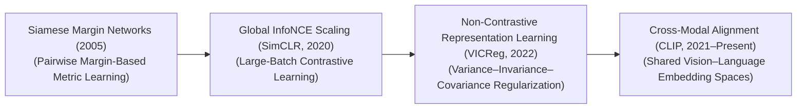
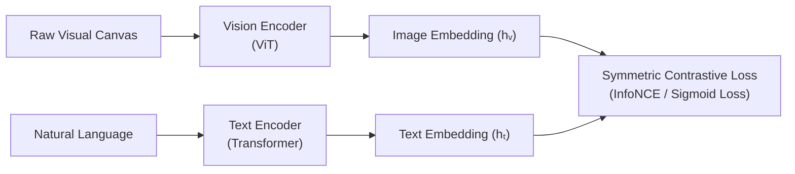

# 🌟 Awesome Contrastive Learning

  

  

> **Keywords**: Self-Supervised Learning, Metric Learning, Representation Learning, Siamese Networks, InfoNCE Loss, VICReg, SigLIP, Triplet Loss, Computer Vision (CV), Natural Language Processing (NLP), Multimodal AI, RAG.
## 🧠 Contrastive Learning in AI: History, Progression, Variants, & Applications

**Contrastive Learning** is a foundational self-supervised representation learning paradigm designed to map raw, unlabelled data into a continuous, lower-dimensional embedding space without human annotations [INDEX: 4]. The core mathematical objective is intuitive yet mathematically rigorous: the framework forces the neural network to learn representations by pulling semantically similar inputs (positive pairs) close together in the latent space while aggressively pushing dissimilar inputs (negative pairs) far apart. 

By restructuring data spaces based on relative similarity rather than static target categories, Contrastive Learning extracts highly resilient, universal features. This architecture serves as the computational backbone underpining modern self-supervised computer vision backbones, open-vocabulary cross-modal encoders, and trillion-token Large Language Model embedding layers [INDEX: 4].

---

## ⏳ 1. The Macro Chronological Evolution

The technical framework governing similarity-based extraction has transitioned from early parametric Siamese distance checks to global cross-entropy matrix allocations, moving toward non-contrastive variance tracking and unified cross-modal foundation tokenization engines.

| Era / Phase | Key Concepts & Limitations | Year First Used | First Used Paper |
| :--- | :--- | :--- | :--- |
| [**The Pairwise Siamese Margin Era (Traditional Deep Learning, ~2005–2018)**](docs/siamese_margin_era.md) | **Concept:** The theoretical genesis popularized by Yann LeCun's lab. Early frameworks deployed **Siamese Networks**—passing two separate inputs through parallel, twin neural towers with shared weights. Optimization utilized a **Contrastive Loss function** configured with a hardcoded margin parameter: if two items were tagged as different, the gradients pushed their Euclidean distance apart only until they crossed that specific metric boundary threshold.  **Limitation:** Fragile and unscalable. The loss evaluated data strictly in independent pairs, failing to capture global coordinate geometries, which caused models to suffer from slow convergence. | 2006 | [Hadsell et al. (2006)](https://ieeexplore.ieee.org/document/1640964) |
| [**The Global InfoNCE Matrix Scale Era (SimCLR / MoCo, ~2020–2022)**](docs/global_infonce_era.md) | **Concept:** Sparked the modern self-supervised vision boom. Chen et al. introduced **SimCLR (2020)**, demonstrating that applying random stochastic augmentations (like cropping or color shifts) to a single image could create a pristine positive pair natively [INDEX: 4]. It replaced margin metrics with the **InfoNCE loss function** (a Softmax-based categorical cross-entropy equation) [INDEX: 10]. It treats the augmented twin as the single positive target, while treating every other image inside a massive mini-batch as a negative sample.  **Limitation:** Critically memory-bandwidth bound. To prevent representation collapse, InfoNCE requires thousands of negative examples concurrently, demanding massive mini-batch sizes (e.g., 32,768) that saturated GPU VRAM. | 2020 | [Chen et al. (2020)](https://arxiv.org/abs/2002.05709) |
| [**The Non-Contrastive Information Maximization Era (VICReg / Barlow Twins, 2022)**](docs/non_contrastive_era.md) | **Concept:** Dismantled the requirement for negative samples entirely [INDEX: 4]. Frameworks like **VICReg (Variance-Covariance-Invariance Regularization)** proved that an unsupervised model could learn high-quality representations purely by looking at positive pairs [INDEX: 4]. It prevented the system from collapsing into a dead state (mapping all inputs to a single constant vector) by appending strict mathematical constraints that explicitly decouple latent channels from each other [INDEX: 4].  **Significance:** Slashed VRAM hardware tracking parameters drastically, allowing models to extract high-yield features without relying on massive, distributed batch sizes [INDEX: 4]. | 2021 | [Zbontar et al. (2021)](https://arxiv.org/abs/2103.03230) |
| [**The Multi-Modal Joint Embedding Era (~2021–Present)**](docs/multimodal_embedding_era.md) | **Concept:** The current modern state-of-the-art foundation standard. Rather than calculating similarity boundaries across isolated visual frames, it maps diverse modalities into a single shared coordinate sphere [INDEX: 10]. Modern architectures use **Sigmoid Loss (SigLIP)** to replace global InfoNCE matrix calculations with localized, pairwise binary logistic classification steps, scaling open-vocabulary text-image alignments past trillion-token limits [INDEX: 10]. | 2021 | [Radford et al. (2021)](https://arxiv.org/abs/2103.00020) |

---

## 🧮 2. Core Functional & Algorithmic Loss Variants

Contrastive frameworks are strictly categorized based on how the similarity loss matrices are mathematically formulated and normalized at training time.

| Loss Variant | Mathematical Mechanism & Behavior | Year First Used | First Used Paper |
| :--- | :--- | :--- | :--- |
| [**InfoNCE Loss (Multi-Class Contrastive Cross-Entropy)**](docs/infonce_loss.md) | **Mechanism:** Normalizes a target positive dot product against the exponential sum of all negative dot products within the active batch, scaled by a temperature parameter ($\tau$): $$\mathcal{L}_{\text{InfoNCE}} = -\log \frac{\exp(\text{sim}(q, k_+) / \tau)}{\exp(\text{sim}(q, k_+) / \tau) + \sum_{i} \exp(\text{sim}(q, k_i^-) / \tau)}$$ **Behavior:** Acts as a continuous, dynamic probability filter, aggressively forcing unaligned vectors to opposite poles of the latent hypersphere [INDEX: 10]. | 2018 | [Oord et al. (2018)](https://arxiv.org/abs/1807.03748) |
| [**Sigmoid Loss (SigLIP Class)**](docs/sigmoid_loss.md) | **Mechanism:** Formulates optimization as an independent binary classification step per matrix element, avoiding global batch-wide denominator normalization loops: $$\mathcal{L}_{\text{SigLIP}} = -\sum_{i, j} \log \sigma \left( c_{i,j} \cdot \text{sim}(q_i, k_j) \right)$$ Where $c_{i,j} = 1$ if $i=j$ (positive pair) and $-1$ otherwise.  **Pros:** Decouples contrastive scaling from mini-batch boundaries, maximizing hardware processing efficiency [INDEX: 10]. | 2023 | [Zhai et al. (2023)](https://arxiv.org/abs/2303.15343) |
| [**Triplet Loss**](docs/triplet_loss.md) | **Mechanism:** Popularized by facial recognition networks (FaceNet). It evaluates a three-part tensor cluster simultaneously: an **Anchor** ($a$), a **Positive** ($p$, same identity), and a **Negative** ($n$, different identity), optimizing the parameters to satisfy: $$\mathcal{L}_{\text{Triplet}} = \max \left( 0, \|\mu(a) - \mu(p)\|_2^2 - \|\mu(a) - \mu(n)\|_2^2 + \alpha \right)$$ | 2014 | [Hoffer & Ailon (2014)](https://arxiv.org/abs/1412.6622) |
| [**Variance-Covariance Regularization (VICReg)**](docs/vicreg_regularization.md) | **Mechanism:** Enforces three distinct independent mathematical penalties over positive-only feature paths: Variance (maintaining coordinate spread), Invariance (pulling augmented views together), and Covariance (decorrelating channels to eliminate parameter redundancy) [INDEX: 4]. | 2022 | [Bardes et al. (2022)](https://arxiv.org/abs/2105.04906) |

---

## 🔄 3. The Cross-Modal Contrastive Integration Matrix

To map alternative sensory signals cleanly into a single shared workspace, contrastive pipelines route unaligned towers through linear projection heads concurrently.

| Component | Technical Profile | Year First Used | First Used Paper |
| :--- | :--- | :--- | :--- |
| [**Cross-Modal Linear Projections**](docs/cross_modal_projections.md) | **Profile:** Coordinates dimensionality mapping. Because independent text and vision backbones output different hidden state sizes, small Multi-Layer Perceptron (MLP) projection heads append to the terminal gates, compressing coordinates into a unified, shared embedding length (e.g., exactly 768 elements) where vector dot products occur [INDEX: 10]. | 2020 | [Chen et al. (2020)](https://arxiv.org/abs/2002.05709) |
| [**Stochastic Augmentation Matrices**](docs/stochastic_augmentations.md) | **Profile:** Generates positive pairs natively [INDEX: 4]. Input graphics are passed through parallel GPU-fused transformation loops (random cropping, color jittering, solarization) to create distinct visual variations, forcing the model to ignore surface-level pixel changes [INDEX: 14]. | 2020 | [Chen et al. (2020)](https://arxiv.org/abs/2002.05709) |

---

## ⚙️ 4. Production Engineering Challenges & Hardware Solutions

Deploying large-scale contrastive learning pipelines across distributed high-performance computing configurations introduces severe memory bus and cluster communication penalties.

| Challenge | Problem & Mitigation | Year First Used | First Used Paper |
| :--- | :--- | :--- | :--- |
| [**The All-Gather Communication and Mini-Batch VRAM Wall**](docs/all_gather_vram_wall.md) | **The Problem:** Evaluating the InfoNCE loss function requires tracking thousands of negative samples simultaneously. In multi-node distributed clusters, this forces the system to execute massive, synchronous **`All-Gather` communication primitives** to fetch gradient embeddings from all other cards, saturating network switches and stalling GPU tensor cores.  **Mitigation:** Migrating entirely to **Sigmoid Loss (SigLIP) architectures**, which decompose matrix tracking into independent element-wise tasks [INDEX: 10], or utilizing **Momentum Contrast (MoCo) memory queues**, decoupling the negative sample capacity footprint from the physical mini-batch size. | 2020 | [He et al. (2020)](https://arxiv.org/abs/1911.05722) |
| [**The Representation Collapse Deficit (Dead Latent Spaces)**](docs/representation_collapse.md) | **The Problem:** If a self-supervised model discovers that outputting an identical, static vector coordinate for *every single incoming view* mathematically zeros out the contrastive loss optimization graph, parameters lock up permanently, rendering the model useless.  **Mitigation:** Implementing **Stop-Gradient operations** across asymmetric paths (such as BYOL), or enforcing strict **covariance identity constraints** to force full tensor dimension utilization [INDEX: 4]. | 2020 | [Grill et al. (2020)](https://arxiv.org/abs/2006.07733) |

---

## 🚀 5. Frontier Real-World AI Industrial Applications

| Application Domain | Description & Implementation | Year First Used | First Used Paper |
| :--- | :--- | :--- | :--- |
| [**Open-Vocabulary Zero-Shot E-Commerce Semantic Personalization**](docs/ecommerce_personalization.md) | **Application:** Processes millions of incoming marketplace seller inventories daily. High-throughput CLIP/SigLIP vision-text encoders project unstructured item listings into a shared coordinate space, letting consumer search engines match conversational text sentences against arbitrary product photos instantly without human annotation pipelines [INDEX: 10]. | 2021 | [Radford et al. (2021)](https://arxiv.org/abs/2103.00020) |
| [**Universal Text Embedding Generation for Enterprise RAG Architectures**](docs/text_embeddings_rag.md) | **Application:** Serves as the critical baseline entry tier powering corporate AI knowledge retrieval [INDEX: 18]. Multi-task contrastive sentence embedding networks process variable-length corporate documentation portfolios, mapping text strings into high-dimensional geometric dense coordinates to execute low-latency vector index search lookups cleanly [INDEX: 18]. | 2019 | [Reimers & Gurevych (2019)](https://arxiv.org/abs/1908.10084) |
| [**Unsupervised Biomolecular Sequence Alignment & Target Drug Discovery**](docs/biomolecular_alignment.md) | **Application:** Maps unannotated DNA, RNA, or protein peptide chains spanning billions of data lines [INDEX: 4]. Information-maximization contrastive regularizers and Siamese networks group complex biological sequences by structural geometry, accelerating target-specific de novo therapeutic discoveries and tracking viral mutations with high precision [INDEX: 4]. | 2019 | [Bepler & Berger (2019)](https://openreview.net/forum?id=S1goBoR9F7) |

---

## 📚 References
1. Hadsell, R., Chopra, S., & LeCun, Y. (2006). Dimensionality reduction by learning an invariant mapping. *Proceedings of the IEEE Computer Society Conference on Computer Vision and Pattern Recognition (CVPR)*, 2, 1735-1742.
2. Oord, A. v. d., Li, Y., & Vinyals, O. (2018). Representation learning with contrastive predictive coding. *arXiv preprint arXiv:1807.03748*.
3. Chen, T., et al. (2020). A simple framework for contrastive learning of visual representations. *International Conference on Machine Learning (ICML)*, 1597-1607 [INDEX: 4].
4. Radford, A., et al. (2021). Learning transferable visual models from natural language supervision. *International Conference on Machine Learning (ICML)*, 8748-8763 [INDEX: 10].
5. Bardes, J., Ponce, J., & LeCun, Y. (2022). VICReg: Variance-covariance-invariance regularization for self-supervised learning. *International Conference on Learning Representations (ICLR)* [INDEX: 4].
6. Zhai, X., et al. (2023). Sigmoid loss for language-image pre-training. *Proceedings of the IEEE/CVF International Conference on Computer Vision (ICCV)* [INDEX: 10].

---

## ⭐ Star History

<a href="https://www.star-history.com/?repos=ishandutta2007%2FAwesome-Contrastive-Learning&type=date&legend=bottom-right">
<picture>
<source media="(prefers-color-scheme: dark)" srcset="https://api.star-history.com/chart?repos=ishandutta2007/Awesome-Contrastive-Learning&type=date&theme=dark&legend=bottom-right" />
<source media="(prefers-color-scheme: light)" srcset="https://api.star-history.com/chart?repos=ishandutta2007/Awesome-Contrastive-Learning&type=date&legend=bottom-right" />

</picture>
</a>

---

To advance this documentation repository, structural setup, or post-training deployment pipeline, consider exploring these adjacent development pathways:
* Build a **Python code snippet using PyTorch** illustrating how to construct a manual InfoNCE contrastive loss layer that tracks a temperature-scaled dot product matrix [INDEX: 10].
* Generate a **comprehensive Markdown table** explicitly comparing Pairwise Siamese Margin Loss, Global InfoNCE (SimCLR), Momentum Contrast (MoCo), Non-Contrastive VICReg, and Sigmoid Loss (SigLIP) across mathematical time complexities, mini-batch size constraints, requirement for negative sample allocations, and vulnerability to latent representation collapse [INDEX: 4, 10].
* Establish an **automated performance profiling harness using Triton** to track the exact computational throughput and memory bus latency metrics achieved when compiling a fused batch-concatenated cross-attention contrastive scoring pass directly inside single-pass GPU memory registers.

***

**Follow-Up Navigation Options Matrix:**

Before updating this documentation repository layout, let me know how you would like to proceed by choosing one of the options below:
* I can provide a **complete Python code boilerplate using PyTorch** demonstrating how to write an automated script that calculates an asymmetric stop-gradient contrastive update loop.
* I can generate a **Markdown matrix table** tracking the explicit projection head dimensions, temperature scaling caps, and data augmentation magnitudes utilized by leading enterprise systems.
* I can write a detailed technical explanation focusing on the **mathematical proof of Uniformity and Alignment** on the hypersphere and how they govern contrastive representation density.

