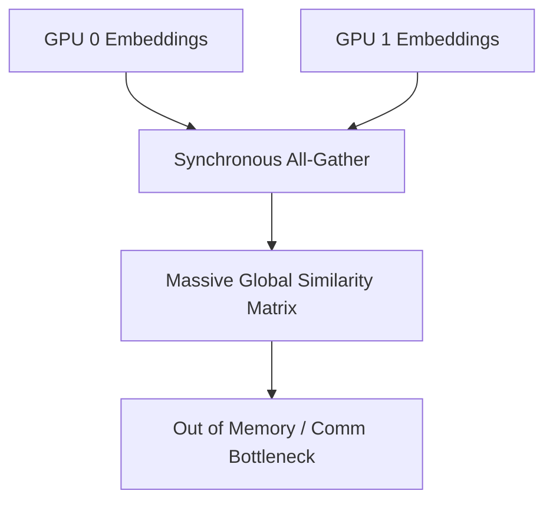

# The All-Gather Communication and Mini-Batch VRAM Wall

The All-Gather bottleneck arises in distributed setups when negative keys must be collected from all GPUs to compute the InfoNCE denominator, leading to high VRAM consumption and high inter-node communication latency.

## Architectural Diagram

---
[← Back to main README.md](../README.md)
