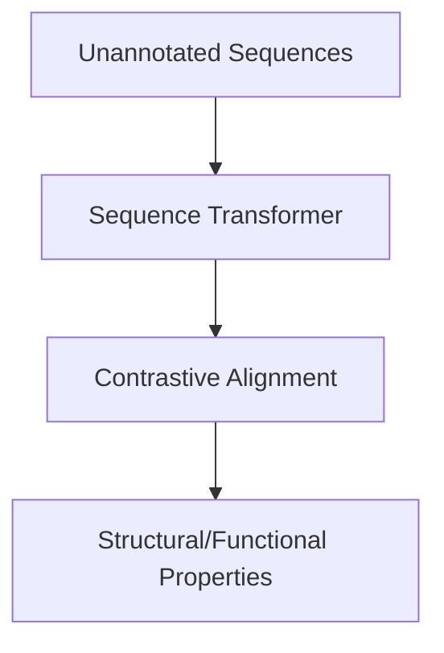

# Unsupervised Biomolecular Sequence Alignment & Drug Discovery

Biomolecular sequence alignment applies contrastive learning to DNA, RNA, and protein sequences to learn embeddings that represent physical or biological properties, accelerating therapeutic compound discovery.

## Architectural Diagram

---
[← Back to main README.md](../README.md)
