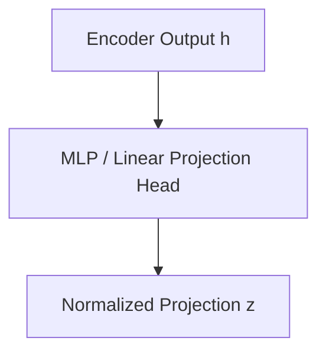

# Cross-Modal Linear Projections

Cross-Modal Linear Projections map different representation dimensions from independent encoders (like vision and language models) into a unified coordinate space where direct similarity computation can happen.

## Architectural Diagram

---
[← Back to main README.md](../README.md)
