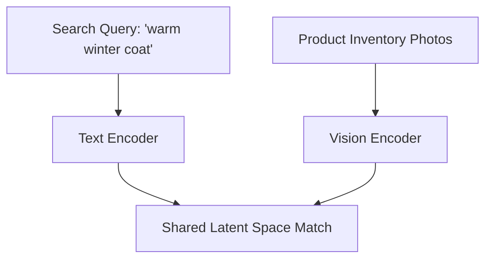

# Open-Vocabulary Zero-Shot E-Commerce Semantic Personalization

E-Commerce semantic personalization leverages joint text-image spaces to enable semantic search, query matching, and recommendations on millions of items without manual labeling.

## Architectural Diagram

---
[← Back to main README.md](../README.md)
