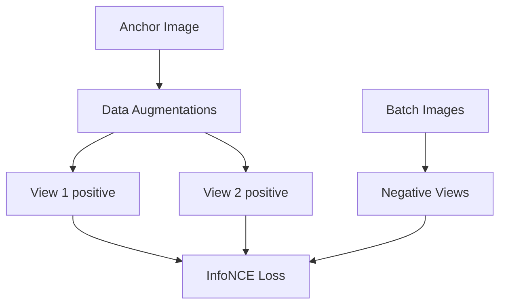

# The Global InfoNCE Matrix Scale Era

The Global InfoNCE Matrix Scale Era (popularized by SimCLR and MoCo) scaled self-supervised representation learning. By utilizing multi-class contrastive cross-entropy, models learned to distinguish positive pairs from large batches of negative pairs.

## Architectural Diagram

---
[← Back to main README.md](../README.md)
