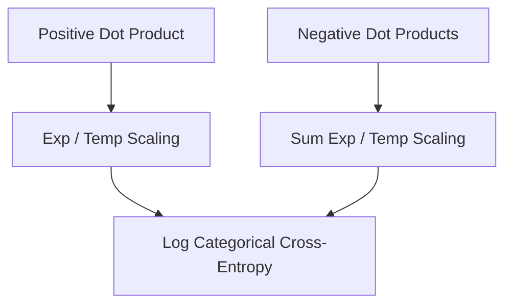

# InfoNCE Loss

InfoNCE is a multi-class classification-based loss function that maximizes mutual information between views. It treats contrastive learning as a classification task with one positive target class and many negative classes.

## Architectural Diagram

---
[← Back to main README.md](../README.md)
