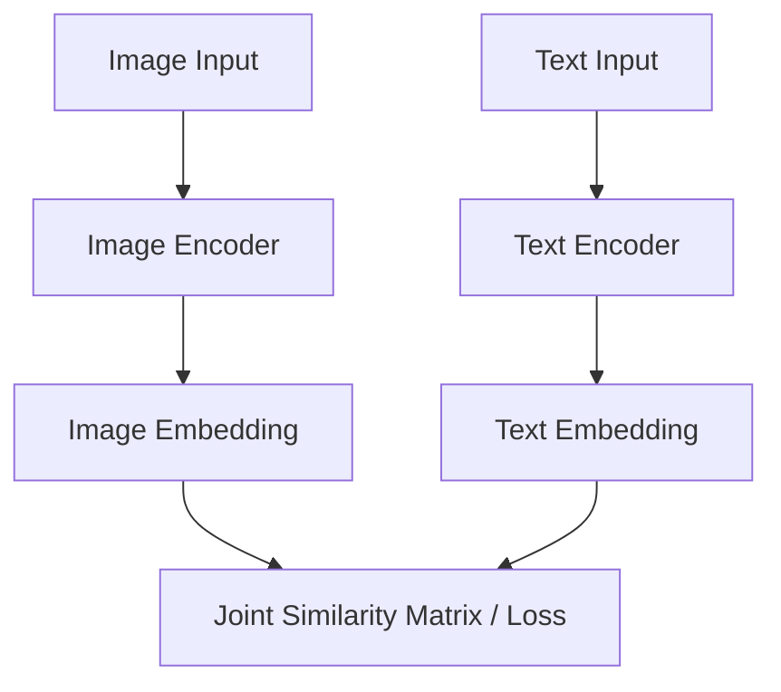

# The Multi-Modal Joint Embedding Era

The Multi-Modal Joint Embedding Era (CLIP, SigLIP) aligns representations of different modalities (like image and text) in a shared semantic vector space. This allows zero-shot open-vocabulary transfer across vision and language tasks.

## Architectural Diagram

---
[← Back to main README.md](../README.md)
