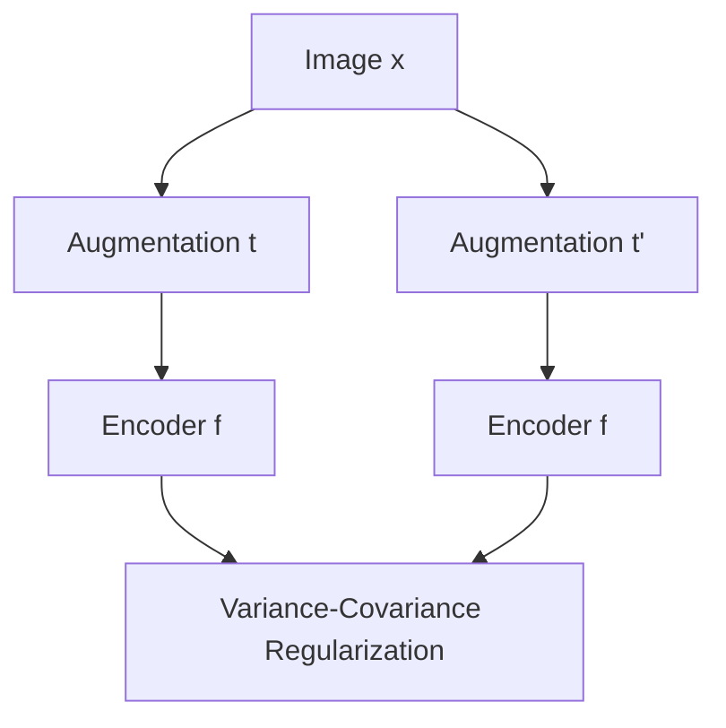

# The Non-Contrastive Information Maximization Era

Non-Contrastive learning (VICReg, Barlow Twins) eliminated negative samples entirely. They prevent representation collapse using explicit variance, invariance, and covariance regularization constraints on positive views.

## Architectural Diagram

---
[← Back to main README.md](../README.md)
