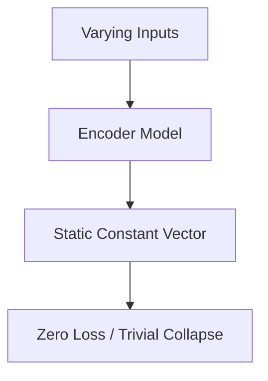

# The Representation Collapse Deficit

Representation collapse occurs when the encoder learns to map all input samples to a constant embedding vector, trivially minimizing contrastive distance. It is avoided using stop-gradients, negative samples, or variance regularization.

## Architectural Diagram

---
[← Back to main README.md](../README.md)
