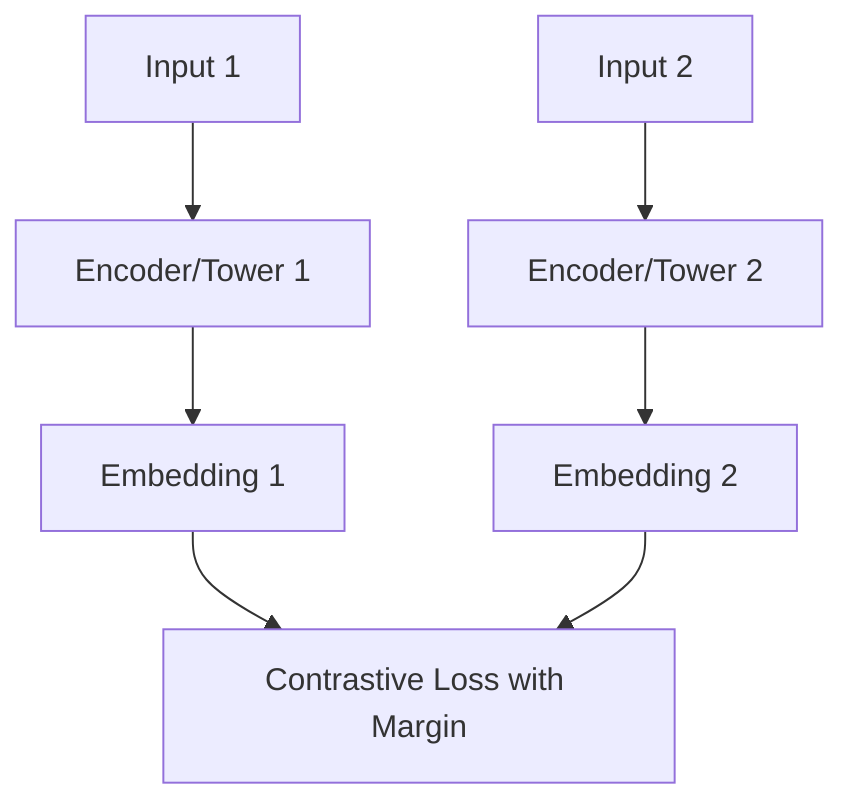

# The Pairwise Siamese Margin Era

The Pairwise Siamese Margin Era marked the early stages of deep metric learning. Twin neural networks (Siamese towers) shared weights and mapped inputs into an embedding space. Optimization relied on minimizing distance between positive pairs while pushing negative pairs away up to a hardcoded margin.

## Architectural Diagram

---
[← Back to main README.md](../README.md)
