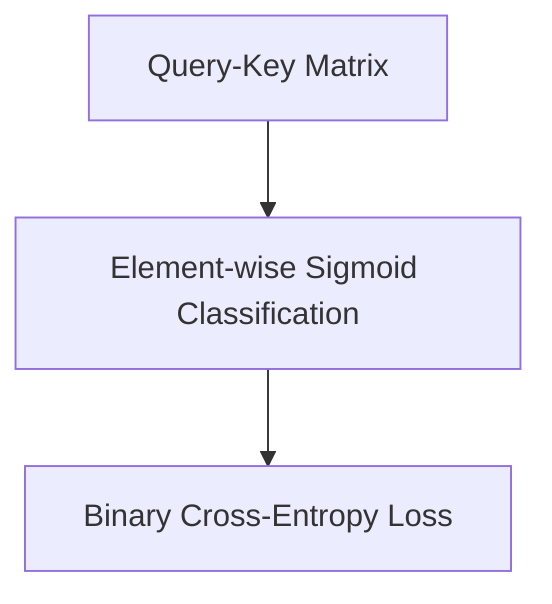

# Sigmoid Loss (SigLIP)

Sigmoid Loss (SigLIP) replaces global Softmax normalization with independent binary sigmoid classification per element, dramatically increasing throughput and batch-size scaling capabilities.

## Architectural Diagram

---
[← Back to main README.md](../README.md)
