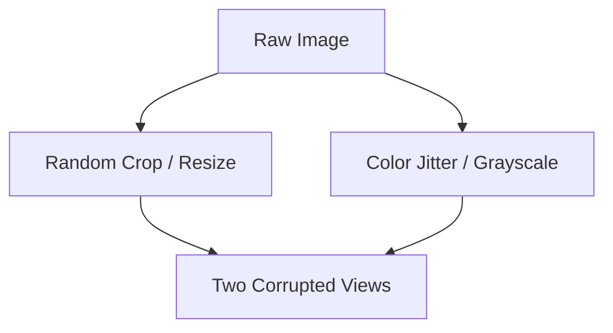

# Stochastic Augmentation Matrices

Stochastic augmentations generate positive pairs from a single input by applying random transformations (e.g., cropping, color jitter, blurring). This forces the network to learn invariant semantic representations.

## Architectural Diagram

---
[← Back to main README.md](../README.md)
