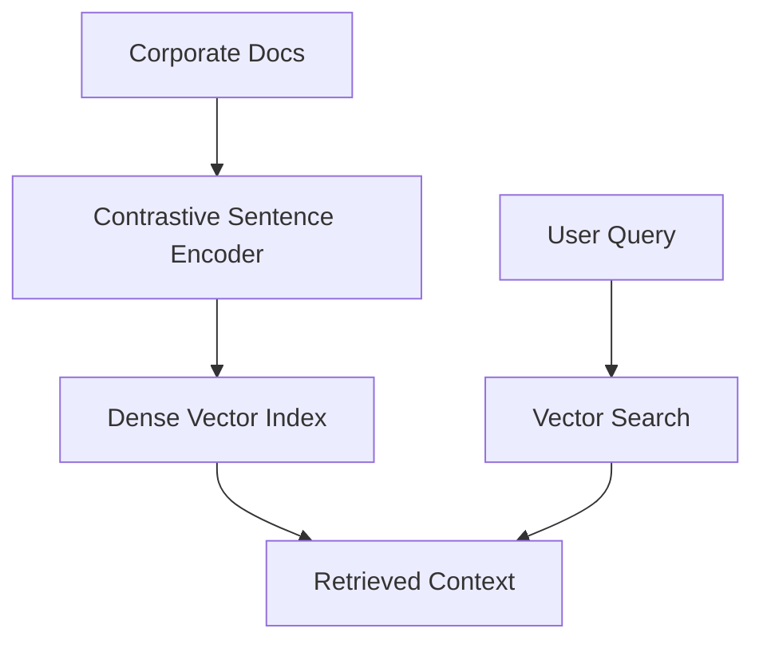

# Universal Text Embedding Generation for Enterprise RAG

Enterprise RAG (Retrieval-Augmented Generation) systems use contrastive sentence embedders to represent knowledge documents as dense vectors. Queries retrieve relevant content based on cosine similarity.

## Architectural Diagram

---
[← Back to main README.md](../README.md)
