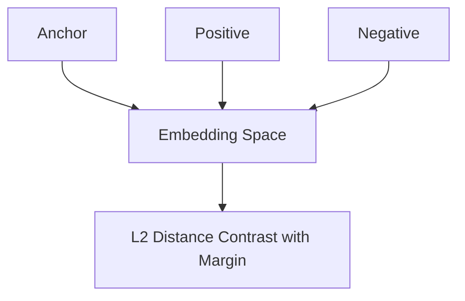

# Triplet Loss

Triplet Loss optimizes the relative distance between an anchor sample, a positive sample (same identity), and a negative sample (different identity). It pulls the positive closer while pushing the negative further away by at least a specified margin.

## Architectural Diagram

---
[← Back to main README.md](../README.md)
