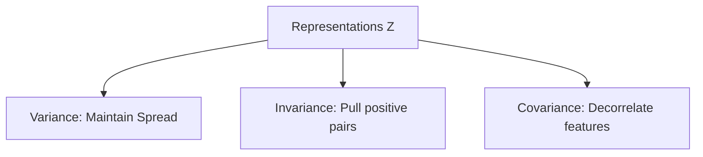

# Variance-Covariance-Invariance Regularization (VICReg)

VICReg regularizes representation learning without negative pairs by enforcing three terms: variance to prevent collapse, invariance to encourage similarity of positive views, and covariance to reduce feature redundancy.

## Architectural Diagram

---
[← Back to main README.md](../README.md)
